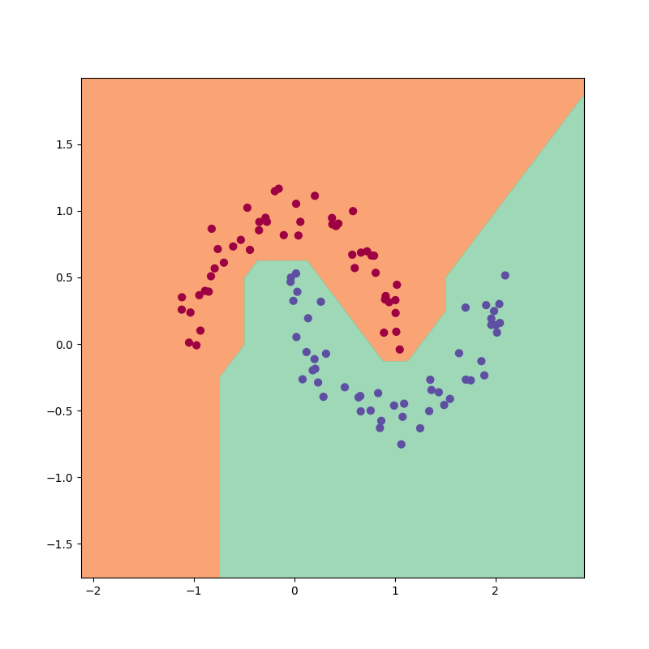
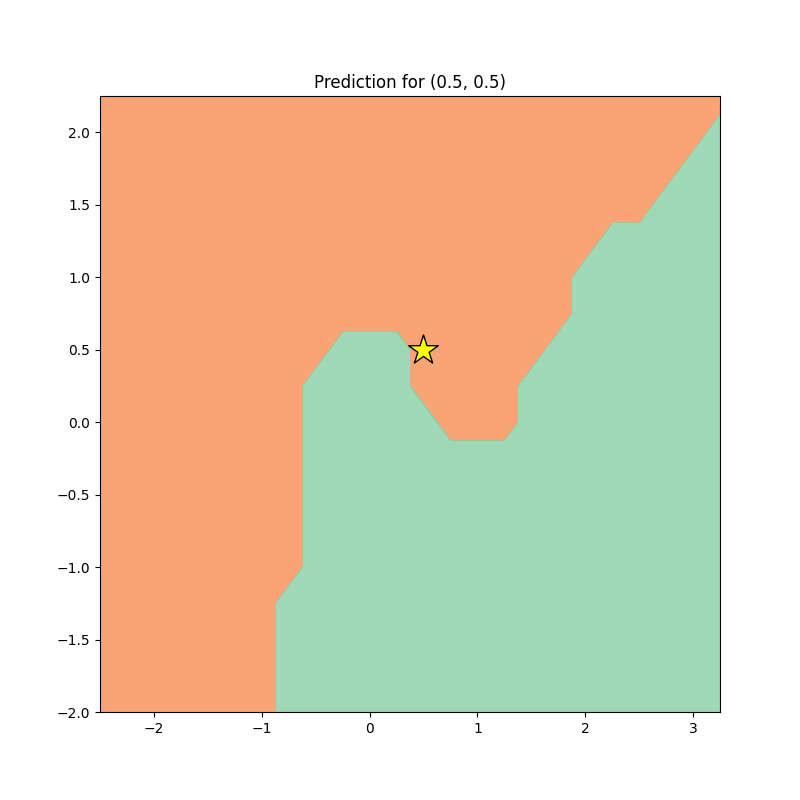

# 🧠 mygrad


**mygrad** is a lightweight, scalar-valued autograd engine and neural network framework built entirely from scratch in pure Python. It dynamically builds a Directed Acyclic Graph (DAG) for mathematical operations and implements backpropagation to train neural networks without relying on massive tensor libraries like PyTorch or TensorFlow.

> **A massive shoutout to Andrej Karpathy (the absolute GOAT 🐐)**. This project was heavily inspired by his incredible `micrograd` library and his zero-to-hero educational series. If you want to understand how deep learning truly works under the hood, his content is mandatory watching!

---

## ✨ Framework Features

* **Autograd Engine (`engine.py`)**: A robust `Value` object that wraps scalars, tracking operations (`+`, `-`, `*`, `/`, `**`, `tanh`, `exp`) and automatically computing gradients via the chain rule.
* **Neural Network API (`nn.py`)**: PyTorch-like abstractions including `Neuron`, `Layer`, and `MLP` classes to easily build complex multi-layer perceptrons.
* **Model Serialization**: Built-in `save_weights` and `load_weights` methods using JSON to save your trained brains and load them instantly for inference without retraining.
* **Architecture Visualization (`visualize.py`)**: Integration with `graphviz` to render microscopic computational graphs and macroscopic MLP architectures. 
  * *Smart Edge Rendering*: In the MLP visualization, edges are color-coded (🔵 **Blue** = Positive Weight, 🔴 **Red** = Negative Weight) and line thicknesses dynamically adjust based on weight magnitude!

---

## 🏆 Highlighted Projects

Using this custom framework, we have built and solved several classic Machine Learning problems:

### 1. Solving the Historic XOR Problem (`test_xor.py`)
In the 1970s, single-layer perceptrons were mathematically proven to be incapable of solving the XOR logic gate, leading to an "AI Winter". By training a custom `MLP(2, [8, 1])` using Mean Squared Error, our network successfully learned the non-linear XOR function, driving the loss down to `0.0004`!

### 2. The "Make Moons" Binary Classifier (`test_moons.py`)
Using `scikit-learn` to generate a complex, interlocking 2D dataset (the "Moons" dataset), we trained a deep `MLP(2, [16, 16, 1])`. 
* **The Result:** The network learned to perfectly curve its decision space to separate the two datasets. We visualized this using `matplotlib` to draw stunning 2D contour maps of the network's learned decision boundary.

### 3. Interactive Prediction Engine (`predict.py`)
We built a production-ready interactive script that loads the pre-trained JSON weights of the "Moons" model. The user can type in any X and Y coordinates, and the script will:
* Instantly classify the coordinate as a Red Moon or Blue Moon.
* Render a fresh 2D decision boundary map and drop a giant **Yellow Star 🌟** exactly where the prediction was made!

---

## 🚀 Quick Start

### Installation
Clone the repository and install the dependencies to generate the visual graphs.
```bash
git clone https://github.com/harshmundra2311/NN_mygrad.git
cd "NN and backpropogation"
pip install graphviz numpy matplotlib scikit-learn
```

### Running the Projects
**Train the Moons Classifier:**
```bash
python test_moons.py
```
*(This will train the network, save the `moons_model.json` weights, and output `moons_decision_boundary.png`)*

**Run the Interactive Predictor:**
```bash
python predict.py
```
*(Enter your coordinates to see the model classify them in real-time and output `prediction_visualized.png`!)*

---

## 📊 Visualizations

*(Check out the images generated by the code!)*

### The Neural Network Architecture (XOR)


### Learned Decision Boundary (Make Moons)


### Interactive Prediction Star


---

### License
MIT
